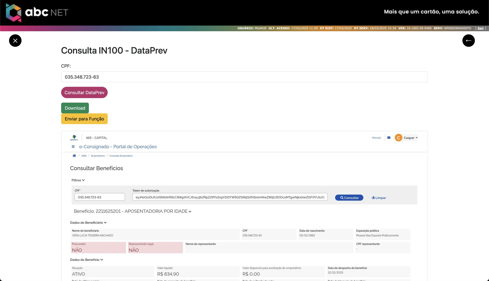

### 📊 **Análise de Código**

🔗 **[Clique aqui para acessar o relatório completo](relatorio/index.html)**

    
🔗 **[Clique aqui para acessar o relatório completo](MicroApps/MicroApp-Consultar-IN100/relatorio/index.html)**

